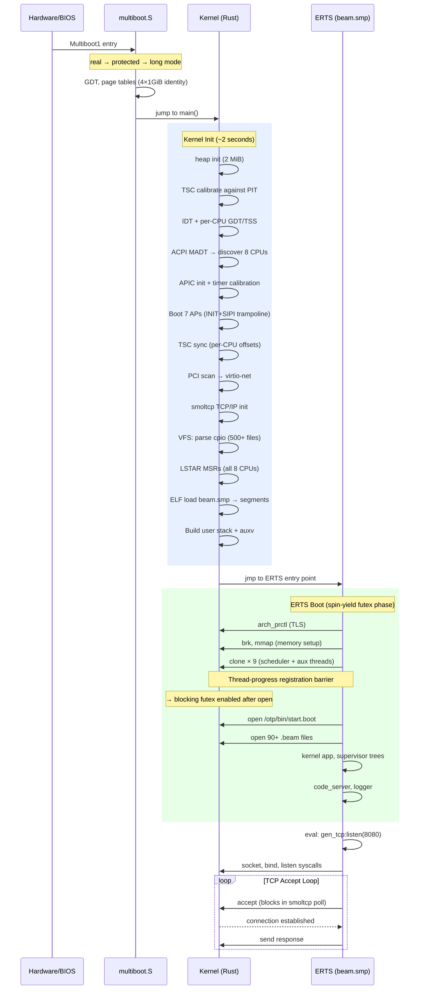
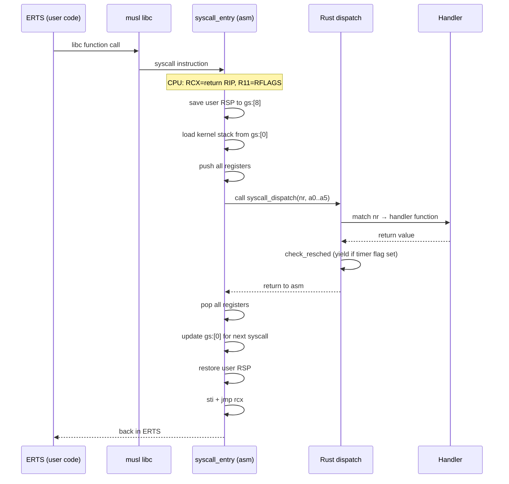

# Boot Flow

## Power On to Erlang Shell

```mermaid
sequenceDiagram
    participant HW as Hardware/BIOS
    participant ASM as multiboot.S
    participant K as Kernel (Rust)
    participant E as ERTS (beam.smp)

    HW->>ASM: Multiboot1 entry
    Note over ASM: real → protected → long mode
    ASM->>ASM: GDT, page tables (4×1GiB identity)
    ASM->>K: jump to main()

    rect rgb(230, 240, 255)
    Note over K: Kernel Init (~2 seconds)
    K->>K: heap init (2 MiB)
    K->>K: TSC calibrate against PIT
    K->>K: IDT + per-CPU GDT/TSS
    K->>K: ACPI MADT → discover 8 CPUs
    K->>K: APIC init + timer calibration
    K->>K: Boot 7 APs (INIT+SIPI trampoline)
    K->>K: TSC sync (per-CPU offsets)
    K->>K: PCI scan → virtio-net
    K->>K: smoltcp TCP/IP init
    K->>K: VFS: parse cpio (500+ files)
    K->>K: LSTAR MSRs (all 8 CPUs)
    K->>K: ELF load beam.smp → segments
    K->>K: Build user stack + auxv
    end

    K->>E: jmp to ERTS entry point

    rect rgb(230, 255, 230)
    Note over E: ERTS Boot (spin-yield futex phase)
    E->>K: arch_prctl (TLS)
    E->>K: brk, mmap (memory setup)
    E->>K: clone × 9 (scheduler + aux threads)
    Note over E,K: Thread-progress registration barrier
    Note over K: → blocking futex enabled after open #92
    E->>K: open /otp/bin/start.boot
    E->>K: open 90+ .beam files
    E->>E: kernel app, supervisor trees
    E->>E: code_server, logger
    end

    E->>E: eval: gen_tcp:listen(8080)
    E->>K: socket, bind, listen syscalls

    loop TCP Accept Loop
        E->>K: accept (blocks in smoltcp poll)
        K-->>E: connection established
        E->>K: send response
    end
```

## Syscall Flow

```mermaid
sequenceDiagram
    participant U as ERTS (user code)
    participant M as musl libc
    participant A as syscall_entry (asm)
    participant R as Rust dispatch
    participant H as Handler

    U->>M: libc function call
    M->>A: syscall instruction
    Note over A: CPU: RCX=return RIP, R11=RFLAGS
    A->>A: save user RSP to gs:[8]
    A->>A: load kernel stack from gs:[0]
    A->>A: push all registers
    A->>R: call syscall_dispatch(nr, a0..a5)
    R->>H: match nr → handler function
    H-->>R: return value
    R->>R: check_resched (yield if timer flag set)
    R-->>A: return to asm
    A->>A: pop all registers
    A->>A: update gs:[0] for next syscall
    A->>A: restore user RSP
    A->>A: sti + jmp rcx
    A-->>U: back in ERTS
```
