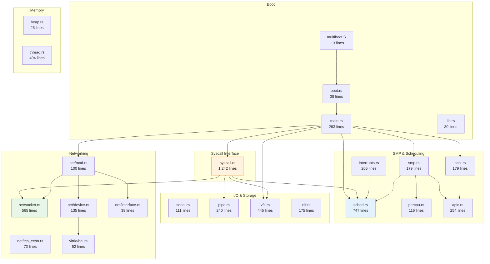

# Module Structure

**Total: 5,739 lines across 26 files**

The three largest modules:
- **syscall.rs** (1,242) — Linux syscall emulation layer
- **sched.rs** (747) — SMP scheduler with futex, idle context, preemption
- **net/socket.rs** (565) — POSIX socket layer bridging ERTS to smoltcp
