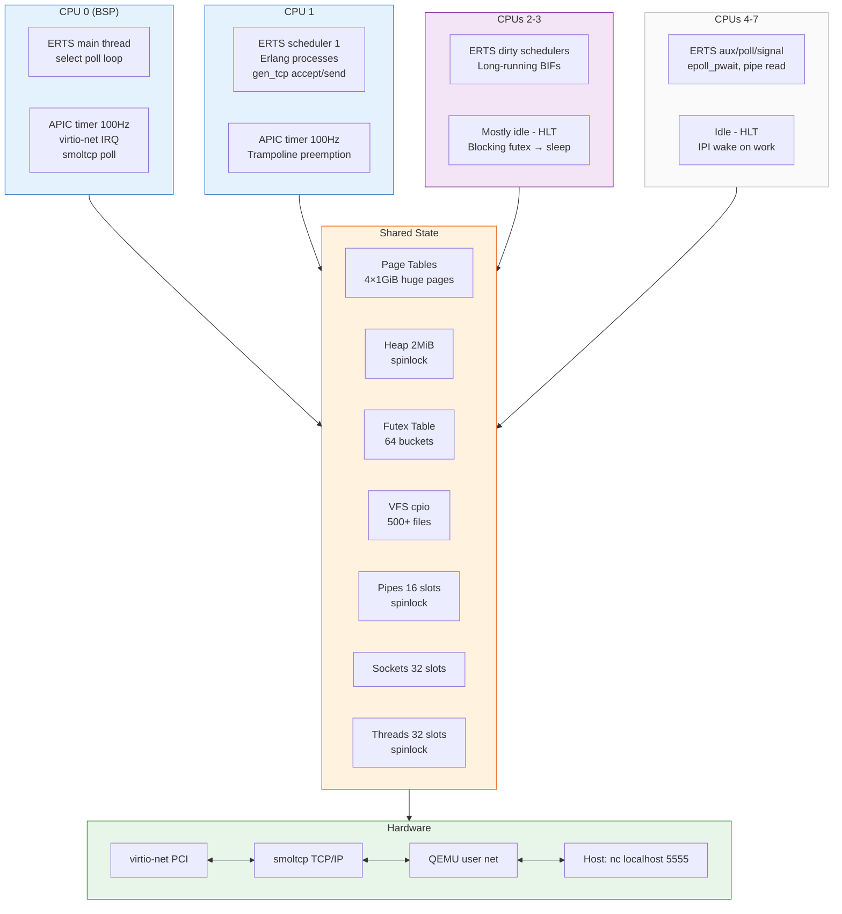
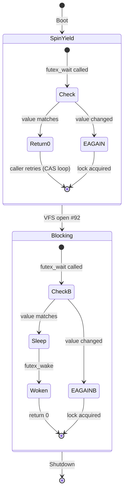
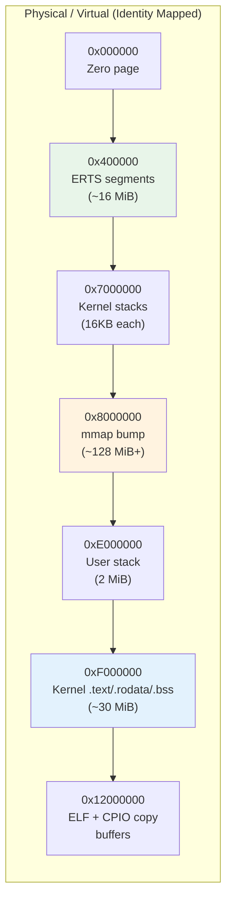

# Runtime Architecture

## CPU Layout When Serving TCP

```mermaid
graph TB
    subgraph CPU0["CPU 0 (BSP)"]
        T0[ERTS main thread<br/>select poll loop]
        K0[APIC timer 100Hz<br/>virtio-net IRQ<br/>smoltcp poll]
    end

    subgraph CPU1["CPU 1"]
        T1[ERTS scheduler 1<br/>Erlang processes<br/>gen_tcp accept/send]
        K1[APIC timer 100Hz<br/>Trampoline preemption]
    end

    subgraph CPU23["CPUs 2-3"]
        T2[ERTS dirty schedulers<br/>Long-running BIFs]
        K2[Mostly idle - HLT<br/>Blocking futex → sleep]
    end

    subgraph CPU47["CPUs 4-7"]
        T3[ERTS aux/poll/signal<br/>epoll_pwait, pipe read]
        K3[Idle - HLT<br/>IPI wake on work]
    end

    subgraph Shared["Shared State"]
        PT[Page Tables<br/>4×1GiB huge pages]
        HP[Heap 2MiB<br/>spinlock]
        FT[Futex Table<br/>64 buckets]
        VFS[VFS cpio<br/>500+ files]
        PIPE[Pipes 16 slots<br/>spinlock]
        SOCK[Sockets 32 slots]
        THR[Threads 32 slots<br/>spinlock]
    end

    subgraph HW["Hardware"]
        VN[virtio-net PCI]
        SM[smoltcp TCP/IP]
        QM[QEMU user net]
        HOST[Host: nc localhost 5555]
    end

    CPU0 --> Shared
    CPU1 --> Shared
    CPU23 --> Shared
    CPU47 --> Shared
    Shared --> HW
    VN <--> SM <--> QM <--> HOST

    style CPU0 fill:#e3f2fd,stroke:#1565c0
    style CPU1 fill:#e3f2fd,stroke:#1565c0
    style CPU23 fill:#f3e5f5,stroke:#7b1fa2
    style CPU47 fill:#fafafa,stroke:#bdbdbd
    style Shared fill:#fff3e0,stroke:#e65100
    style HW fill:#e8f5e9,stroke:#2e7d32
```

## Futex Strategy

```mermaid
stateDiagram-v2
    [*] --> SpinYield: Boot
    SpinYield --> Blocking: VFS open #92
    Blocking --> [*]: Shutdown

    state SpinYield {
        [*] --> Check: futex_wait called
        Check --> Return0: value matches
        Return0 --> [*]: caller retries (CAS loop)
        Check --> EAGAIN: value changed
        EAGAIN --> [*]: lock acquired
    }

    state Blocking {
        [*] --> CheckB: futex_wait called
        CheckB --> Sleep: value matches
        Sleep --> Woken: futex_wake
        Woken --> [*]: return 0
        CheckB --> EAGAINB: value changed
        EAGAINB --> [*]: lock acquired
    }
```

## Memory Layout

```mermaid
graph LR
    subgraph "Physical / Virtual (Identity Mapped)"
        A["0x000000<br/>Zero page"]
        B["0x400000<br/>ERTS segments<br/>(~16 MiB)"]
        C["0x7000000<br/>Kernel stacks<br/>(16KB each)"]
        D["0x8000000<br/>mmap bump<br/>(~128 MiB+)"]
        E["0xE000000<br/>User stack<br/>(2 MiB)"]
        F["0xF000000<br/>Kernel .text/.rodata/.bss<br/>(~30 MiB)"]
        G["0x12000000<br/>ELF + CPIO copy<br/>buffers"]
    end

    A --> B --> C --> D --> E --> F --> G

    style B fill:#e8f5e9
    style F fill:#e3f2fd
    style D fill:#fff3e0
```
